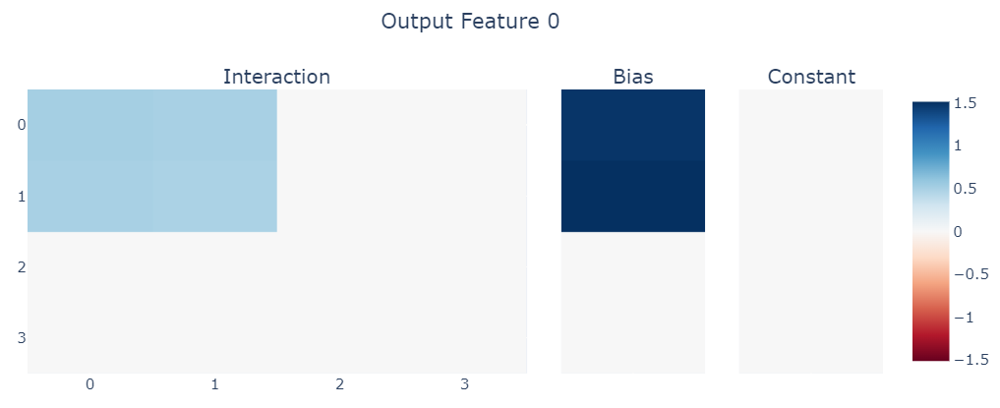
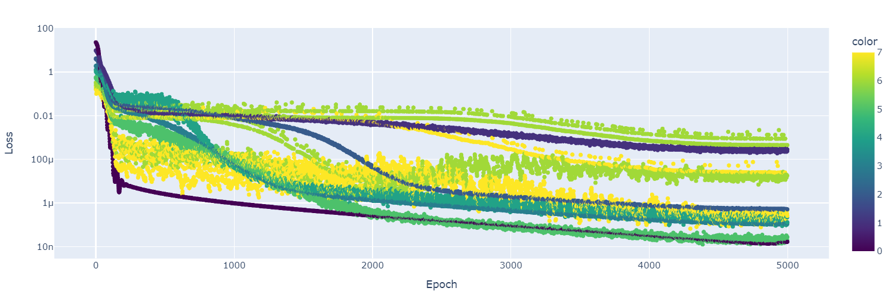

# Computation in Superposition
**Thomas Dooms (26/03/2024)**

This document studies computation in superposition for bilinear layers. Bilinear layers are especially suited for this task because the internal algorithms of the model can be read out from the weights alone and do not need any input, even not when using multiple layers. This makes reasoning about these tasks especially fruitful because one can predict the exact optimal solution beforehand.

This document will specifically look at binary operations, meaning only between two features. Given two features $x$ and $y$. We can define all their interactions towards an output feature $o$ with the following formula.

> TODO: Make a note about why $2ab$ but not $2a$ or $2b$.

$f^o_{xy} = aa^o \cdot x^2 + bb^o \cdot y^2 + 2ab^o \cdot xy + a^o \cdot x + b^o \cdot y + \gamma^o \cdot 1$

First, we will ignore the superscript that indicates the output feature for simplicity. Second, $aa$ refers to a fully distinct variable from $a$. This is slightly strange, but preferable over using arbitrary letters for each weight. To analyze this equation in a structured manner, we will use a slight variant to truth tables.

## Boolean Operations

In this case, the inputs are boolean, therefore the influence of any of the factors (for instance $x^2$) can only be on or off.
This means that we can extract very simple constraints from the provided truth tables. The following are a few examples.

### AND gate

|$x^2$|$y^2$|$2xy$|$x$|$y$|$1$|out|
|:---:|:---:|:---:|:-:|:-:|:------:|:-:|
|0|0|0|0|0|$\gamma$|0|
|$aa$|0|0|$a$|0|$\gamma$|0|
|0|$bb$|0|0|$b$|$\gamma$|0|
|$aa$|$bb$|$2ab$|$a$|$b$|$\gamma$|1|

$\gamma = 0$

$aa + a = 0$

$bb + b = 0$

$2ab = 1$

### XNOR gate

|$x^2$|$y^2$|$2xy$|$x$|$y$|$1$|out|
|:---:|:---:|:---:|:-:|:-:|:------:|:-:|
|0|0|0|0|0|$\gamma$|1|
|aa|0|0|a|0|$\gamma$|0|
|0|bb|0|0|b|$\gamma$|0|
|aa|bb|ab|a|b|$\gamma$|1|

$\gamma = 1$

$aa + a = -1$

$bb + b = -1$

$2ab = 1$

### General Boolean Computation

In general, given a boolean truth table with entries $t_{xx}$, $t_{xy}$, $t_{yx}$ and $t_{yy}$, we can find a closed formula for the optimal weights. We achieve this by simply generalizing the above to this general case, we get:

$\gamma = t_{xx}$

$aa + a = t_{xy} - t_{xx}$

$bb + b = t_{yx} - t_{xx}$

$2ab = t_{yy} - t_{xy} - t_{yx} - t_{xx}$

To get a more complex truth table than the ones above, we can combine gates in arbitrary ways. Let's try $t_{xy} = 3 \cdot \text{AND}(x, y) + 2 \cdot \text{OR}(x, y)$

$\gamma = 0$

$aa + a = (2 + 0) - 0 = 2$

$bb + b = (2 + 0) - 0 = 2$

$2ab = (2 + 3) - 2 - 2 - 0 = 1$

When we train a model on this truth table, we get:

While there are no exact numbers on the plot, the light blue parts are $0.5 \pm 0.01$ and the darker parts are $1.5 \pm 0.01$, which satisfies our constraints. So, this simple derivation allows us to "predict" the optimal solution of a bilinear layer.

### Caveats

There are a few caveats to this. The most important one is weight magnitude; I've noticed that higher target weights take way longer to optimize to. This is fully expected but just something to keep in mind. Second, when creating datasets to train on, you will need a sparsity or probability hyperparameter. If this is very high or low, the model will potentially not see the case where 2 inputs are on or off. Then the model learns the simplest solution ignoring that constraint. When training for very long, there is grokking behavior though, where the model transitions between the exact solution and the approximate one.

This is slightly fuzzy but as there are multiple runs of varying sparsities being plotted (7 is sparsest). This shows the transition (especially the navi blue run) from getting one or two solutions wrong (loss=0.01) to getting everything correct down to numerical error (1 mu).

Another caveat that hasn't been discussed in-depth is noise. Concretely, the model will sometimes include random variables in its computation that cancel out. We never explicitly wrote down a constraint for this but any interaction outside of $x$ and $y$ must sum to zero. However, with this constraint, given variable $z$ that is independent from $x$ and $y$, the model sometimes learns $\mu z^2 - \mu z$ which always sums to 0 if $z$ is binary. While weight decay seems to generally help to counteract such behavior, it is not guaranteed to do so because we are not looking at the weights themselves but at a derivation of them.

### Continuous Operations

Studying continuous operations using truth tables makes less sense because its output and input are not sparse, we will simply use the main formula directly to derive the best exact solutions. All these derivations are very simple so no further explanation will be provided.

#### Summation

$aa \cdot x^2 + bb \cdot y^2 + 2ab \cdot xy + a \cdot x + b \cdot y + \gamma \cdot 1 = x + y$

The best solution is $a = 1$ and $b = 1$, all other terms are $0$.

#### Muliplication

$aa \cdot x^2 + bb \cdot y^2 + 2ab \cdot xy + a \cdot x + b \cdot y + \gamma \cdot 1 = x \cdot y$

The best solution is $2ab = 1$ all other terms are $0$.

### Superposition
<!-- 
The above calculations are useful in a binary setting, but importantly, they can be extended to continuous cases. There are some caveats that or considerations that should be explained. The notation of the interaction variables that is used is quite easy for binary features, for instance $x^2$ and $x$ play a similar role, they're always one if the feature is active.

To ease into the continuous case, let's consider the verbose notation. $\alpha \cdot x^2$. Here, $\alpha$ is the weight of the feature that we see in the plots. Then, $x$ is the magnitude of a specific feature under study. -->

<!-- |$(x-y)^2$|$(x-y)$|$\gamma$|out1|out2|
|:-------:|:-----:|:------:|:--:|:--:|
|0|0|0|0|0|
|$\alpha$|$\lambda$|0|1|0|
|0|1|0|0|1|
|1|1|1|1|1| -->

<!-- The simplest superposition case: a digon, is not an interaction between features, rather it is a single feature that generates two outputs. We can  -->
Until now, we have studied the interaction between two random features $x$ and $y$. However, in a setting with superposition, and especially computation in superposition, the interactions between features depend on their underlying representation. Simply put, an AND operation between two features that are encoded into the same hidden dimension will be different from an AND between two orthogonal features. Therefore, we will make the assumption that our superposition is of the simplest form: digonal (each hidden dimension encodes two features, one negative and one positive, numerically, (1, 0) -> 1 and (0, 1) -> -1).

Given 4 input features: $\alpha$, $\beta$, $\theta$, and $\delta$ we define the hidden dimensions as $x = \alpha - \beta$ and $y = \theta - \delta$. To closely reflect the original Anthropic paper on superposition, we will study the continuous case. Importantly, now the factors (such as $x^2$) cannot simply be ignored. The reconstruction "truth table" from the hidden dimensions looks like the following.

|$x^2$|$y^2$|$2xy$|$x$|$y$|$1$|$\alpha$|$\beta$|$\theta$|$\delta$|
|:---:|:---:|:---:|:-:|:-:|:------:|:--:|:--:|:--:|:--:|
|0|0|0|0|0|$\gamma$|0|0|0|0|
|aa|0|0|a|0|$\gamma$|$\max(x, 0)$|$\min(x, 0)$|0|0|
|0|bb|0|b|0|$\gamma$|0|0|$\max(y, 0)$|$\min(y, 0)$|
|aa|bb|ab|a|b|$\gamma$|$\max(x, 0)$|$\min(x, 0)$|$\max(y, 0)$|$\min(y, 0)$|

This reveals that the optimal solution is for $x$ to be fully independent of $y$, which is to be expected from a digonal encoding. We can now study the case of $x$, the same will hold for $y$. We have the following equations.

$\gamma = 0$

$aa \cdot x^2 + a \cdot x + \gamma = \max(x, 0)$

The first equation is quite straightforward, the second however cannot be solved exactly. The best solution to this in the interval $[-1; 1]$ (found numerically) is $aa=0.464$, $a=0.5$, and $\gamma=0.094$. However, this solution violates the first equation. For simplicity, we will focus on very sparse cases, this means that the first case (where everything is 0) occurs very frequently and should thus be exactly satisfied. If we set that $\gamma=0$, the same process then yields $aa=0.619$ and $a=0.5$. Intuitively, setting $a$ to exactly half results in the least approximation as this results in the quadratic term being as small as possible.

The inverse case has the same solution except the term $a = -0.5$ instead of $0.5$. Note that this is for a different output feature than the formula above, so these weights can be fully different.

$\gamma = 0$

$aa \cdot x^2 + a \cdot x + \gamma = \min(x, 0) = -\max(x, 0)$

TODO: insert image here showing that this is what happens.

It should be noted that the value for $aa$ depends on the distribution of the original features. For instance, a normal distribution will yield a value of about $0.3$ and a uniform distribution between $[-2;2]$ yields about $0.31$ (exactly half of the original value).

> The reason for ReLU's success in large models may be due to this, it is able to exactly represent digonal superposition. It has the exact same formula that we are trying to approximate.

### Superposition $\odot$ AND (WIP)

Given the full above setup, we can now define truth tables for computation in superposition. This is an AND in superposition.

|$x^2$|$y^2$|$2xy$|$x$|$y$|$1$|$\alpha$|$\beta$|$\theta$|$\delta$|
|:---:|:---:|:---:|:-:|:-:|:------:|:--:|:--:|:--:|:--:|
|0|0|0|0|0|$\gamma$|0|0|0|0|
|aa|0|0|a|0|$\gamma$|0|0|0|0|
|0|bb|0|b|0|$\gamma$|0|0|0|0|
|aa|bb|ab|a|b|$\gamma$|$\max(x, 0)$|$\min(x, 0)$|$\max(y, 0)$|$\min(y, 0)$|

Let's study the first output $\max(x, 0)$.

$\gamma = 0$

$aa \cdot x^2 + a \cdot x + \gamma = 0$

$bb \cdot y^2 + b \cdot y + \gamma = 0$

$aa \cdot x^2 + bb \cdot y^2 + 2ab \cdot xy + a \cdot x + b \cdot y + \gamma = \max(x, 0) \Rightarrow 2ab \cdot xy = \max(x, 0)$

As this is binary, the best solution is simply $2ab = 1$ (which are the exact same weights as the multiplication). It seems that boolean computation in superposition is not very exiting.

### Superposition $\odot$ + (WIP)

$aa \cdot x^2 + bb \cdot y^2 + 2ab \cdot xy + a \cdot x + b \cdot y + \gamma = \max(x, 0) + \max(y, 0)$

$aa = 0.55$, $bb = 0.55$, $ab = 0.55$, $a=0.5$, $b=0.5$, and $\gamma=0$

