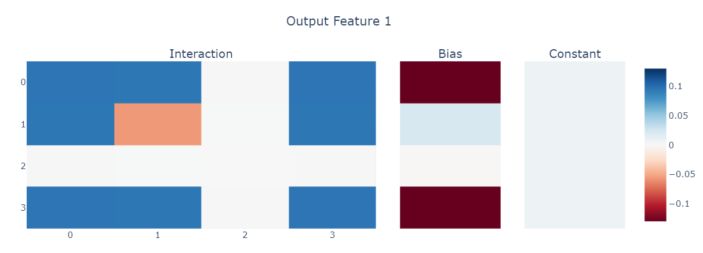

# Ternary Computation

This document is an extension of the binary computation one. The goal of this extension is twofold:

- Bilinear layers can exactly compute any binary operation, they probably can't for ternary operations. How do they approximate?
- Bilinear layers never seem to learn ternary superposition (aka triangles), why?

Any interaction between three variables $x$, $y$ and $z$ can be described by the following 10 variables.

$aa \cdot x^2 + bb \cdot y^2 + cc \cdot z^2 + 2ab \cdot xy + 2ac \cdot xz + 2bc \cdot yz + a \cdot x + b \cdot y + c \cdot z + \gamma \cdot 1$

Given the size of this formula, we shouldn't put too much effort into scaling beyond the ternary case by hand.

## Boolean Operations

A good start is to look at ternary versions of boolean gates. Specifically, we are looking at $\text{gate}(\text{gate}(x, y), z)$.

### AND gate

| $x^2$ | $y^2$ | $z^2$ | $2xy$ | $2xz$ | $2yz$ | $x$ | $y$ | $z$ |   $1$    | out |
| :---: | :---: | :---: | :---: | :---: | :---: | :-: | :-: | :-: | :------: | :-: |
|   0   |   0   |   0   |   0   |   0   |   0   |  0  |  0  |  0  | $\gamma$ |  0  |
| $aa$  |   0   |   0   |   0   |   0   |   0   | $a$ |  0  |  0  | $\gamma$ |  0  |
|   0   | $bb$  |   0   |   0   |   0   |   0   |  0  | $b$ |  0  | $\gamma$ |  0  |
|   0   |   0   |  cc   |   0   |   0   |   0   |  0  |  0  |  c  | $\gamma$ |  0  |
|  aa   |  bb   |   0   |  ab   |   0   |   0   |  a  |  b  |  0  | $\gamma$ |  0  |
|  aa   |   0   |  cc   |   0   |  ac   |   0   |  a  |  0  |  c  | $\gamma$ |  0  |
|   0   |  bb   |  cc   |   0   |   0   |  bc   |  0  |  b  |  c  | $\gamma$ |  0  |
|  aa   |  bb   |  cc   |  ab   |  ac   |  bc   |  a  |  b  |  c  | $\gamma$ |  1  |

A simple diagonalization of this matrix shows that it has no exact solutions. Therefore, analytic analysis will be less prominent now. Again, the approximation is very highly dependent on the sparsity, the dense case always predicts $1$, the other extreme always predicts $0$. In the middle the tradeoff of actually doing something seems worth it. This is an image of the 75% sparsity model.

The approximation is a bit as follows:

- 1 feature active: -0.03
- 2 features active: 0.02 (0.12 in the asymmetric case)
- 3 features active: 0.37

This asymmetry seems to be prevalent across outputs it seems, indicating that this is the best solution. Looking at the outputs, this seems apparent, it has very good approximations in the large majority of the cases (the asymmetric case only occurs in a third of the cases where 2 features are active, which is not very often).

### OR gate

The OR gate has an excellent approximation across sparsities. In the semi-sparse case, it uses $-0.5$ for all interactions and $1.5$ for the biases. This results in a perfect approximation for all cases except when all three features are active. Lower sparsities seem to compensate slightly for this by performing a tradeoff ($-0.47$ as interactions and $1.47$ as bias). In contrast, the sparsest case doesn't converge to this solution except after a few thousand iterations.
