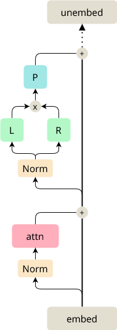

# Analyzing Bilinear Language Models

We want to demonstrate that bilinear layers, when used in transformer models are able to scale to language tasks. In a sense, this has been shown in [the Noam paper](). However, this paper only demonstrated that the accuracy of bilinear transformers matched or even outperformed normal GeLU-based transformers. In this document, we want to tackle the ambitious task of using out interpretability techniques to thoroughly understand this class of models. We aim to achieve this on the simplest (real-world) language task; children's stories. [TinyStories]() is an awesome dataset due to its simplicity. In short, it contains 2 million stories using the vocabulary of a 3-year old. This makes it possible to use tiny models to fit this dataset. Fascinatingly, these tiny models (with even less than 1M parameters) can coherently construct simple sentences and relate certain words together to tell a story. 

## Setup

Usually, language models are trained with a single goal in mind, achieve the lowest loss (or complexity) possible. In this work, this isn't the case, we strive to optimize for interpretability. This means that as long as the model can generate coherent output, we don't really care about how good the generated text is. This allows us to make some strong design choices which significantly simplify the model. The following sections describe the setup and design process in no particular order.

### Architecture

HuggingFace contains a wide range of transformer models that can be tweaked without much effort. However, all these models obviously use ordinary activation functions such as GeLU (and lots of other weird names ending in LU). Hence, we need to create our own models. Luckily, there are great resources online, such as [this tutorial from Karpathy]().

In terms of noteworthy design choices there isn't much to say. This uses RMSnorm, instead of LayerNorm as most modern architectures do. We use multi-head attention (generally with head size ~64), which also isn't a shocker. We also use no weight tying.

### Ablations

We also performed a limited amount of semi-rigorous ablations:

**Switching the order of the MLP**. Swapping the linear projection and the bilinear operations is way worse (loss goes up by 0.2).

**Not using biases in the bilinear layer**. The difference is negligible but slightly in favor of including it (loss goes up to 0.02).

**Initialization**. I haven't studied this in-depth, it seems to have a large impact (easily 0.1 loss). The initialization variation between runs seems to not matter at all (same loss up to 2 decimal points).

**Comparison to ReLU**. From a handful of experiments we can corroborate the findings of [the Noam paper](). For fairness, we use the usual $\text{n\_hidden} = 4 \cdot \text{d\_model}$ for ReLU and $\text{n\_hidden} = 3 \cdot \text{d\_model}$ for the bilinear case. This results in about $8\%$ more parameters for the bilinear setup (using a multiplier of 2 still outperforms the ReLU, which is $16\%$ less parameters) and outperforms it by a loss of ~0.05.

### Training

We perform training with a default HuggingFace trainer, no special settings at all. $\text{lr}=0.001$ and $\text{batch\_size} = 16$. Most models take about 20-30 minutes to train on my NVIDIA RTX 4080. I haven't calculated the effective FLOPS but given the its temperature and lack of noise, there is probably some bottleneck.

### Tokenizer

The original TinyStories models use the pre-trained NeoGPT tokenizers. However, to keep the parameter count down, they only use the top 10,000 tokens. While, this results in a semi-general tokenizer, here, we don't care about that. Reducing the vocabulary size is generally nice for interpretability because this generally results in less tokenization aberrations that have been plaguing the mechinterp community for a while. Furthermore, small vocabularies actually make it possible to fully plot interaction matrices.

Therefore, we decided to train our own tokenizers, specifically for TinyStories. In the spirit of interpretability, we made some interesting design decisions: only ascii characters and only lowercase letters. We separate punctuation into distinct tokens and use the WordPiece algorithm. I'm no expert on BPE vs WordPiece but the latter seems to better fit this use-case intuitively.

Using this setup, we can drastically compress the vocabulary into 3 sizes: 4096, 2048, and 1024. The large tokenizer has a separate token for almost all common words (even animals and simple names) that occur in children's stories, it uses 188 tokens on average per story. The medium tokenizer also has separate tokens for almost each word but starts to separate noticeable more words, its mean is 203 per story. The smaller one obviously splits all but the most common words, it uses 229 tokens on average.

Having a more focussed tokenizer also strongly eases the training process, resulting in lower loss and cleaner generation. It also strongly reduces the amount of embedding/unembedding parameters.

> As a tiny aside, we found that a significant part of the training data has some corruption. We removed this, it doesn't really make a difference.

### Results

Our optimizations of the tokenizer and the bilinear layer result on some very strong models. We are generally able to beat their loss with models that are half or even a third of the size (on the 4096 tokenizer for the most fair comparison). Our 400K model, outperforms the 1.2M model, our 1.1M model outperforms their 3.5M model and so forth. While this doesn't really matter too much, its nice to see.

### Models

I pushed a wide range of models onto [my HuggingFace account](https://huggingface.co/tdooms). Generally, all models use the medium tokenizer and use the convention "TinyStories-{n_layer}-{d_model}". There are a few models, trained on the small tokenizer, called "MicroStories-...". The tokenizers are named after their vocabulary size.

### Folding

Ideally, just as in the toy setup case, we would like to fold all possible operations into a single tensor. For the single layer transformer, we would prefer to have two objects.

- The OV++ tensor: this tensor is the result of folding the OV tensor into the B-tensor and the residual stream. In essence, this tensor describe the **exact** consequence of the attention operation. This would have dimensions $\text{d\_model} \times \text{d\_model} \times \text{d\_model}$. We can multiply this tensor with the unembedding matrix at each dimension to see the exact binary interactions of words.
- The QK matrix: this is the plain old QK matrix, with the embeddings folded into it as well. This would have dimensions $\text{d\_model} \times \text{d\_model}$. This, again, can be multiplied at either side by the token embedding or even the positional embedding to exactly determine how tokens interact.

Let's dissect how to construct this OV++ tensor. First, we need a single object to describe all operations after the OV matrix. The can fold the $B_{mlp}$, $O_{mlp}$ without any issue. The residual stream is slightly more complex. There is (as far as I could think of) no simple way to "add" an identity operation to this bilinear map. However, a potential solution is to simply concatenate a whole identity matrix to either side of the constituent B matrices. On the other side, we concatenate a bias term consisting wholly of ones. We then construct a "doubled" B tensor from this with the following dimensions $\text{d\_model} \times 2 \cdot \text{d\_model} \times 2 \cdot \text{d\_model}$, where the input is expected to be $\text{cat}(x, x)$.

On the surface, this seems to be overly convoluted but this is where the original OV matrix comes into play. When using a single head, the $OV$ matrix has size $\text{d\_model} \times \text{d\_model}$, we can double this to become $\text{d\_model} \times 2\cdot \text{d\_model}$. Then, we fold this doubled matrix into the doubled $B$ tensor. The result is an undoubled tensor just consisting of $\text{d\_model} \times \text{d\_model} \times \text{d\_model}$, which is exactly what we wanted. When using multiple heads, we perform the a similar operation such resulting in a tensor with dims $\text{n\_head}\times \text{d\_model} \times \text{d\_head} \times \text{d\_head}$.

Within this analysis, I have ignored the normalization operation right before the MLP. The can fold the $\gamma$ and $\alpha$ into the B tensor as usual, however, we also have to account for the division. We are using RMS, so there is only a single term. Sadly, as this term relies on exact activations, we need input statistics to do so.

### Preliminary notes on interpretability

While this document is mostly supposed to be an introduction to this work and provide a mathematical framework for interpreting these models, I wanted to leave some notes on preliminary experiments. It's strongly possible though that this is a product of factors that were not yet included in the analysis.

**Token-token interactions are not sparse**. It would be fair to expect that most token interactions are very sparse as generally, the majority of words have no influence on others. We've seen this not to be the case, there are a lot of "spurious" relation between words that the model has learnt.

**Strong Token-token relations are very sensible**. Looking at the strongest weights of token-token interactions, there is a lot of activity for obvious n-grams. "playing, play, our, different, other, what <-> games". Also, follow-tokens (idk what the name is), such as "##ought" have strong relations to the obvious prepends such as "br", "f", "s", "th".

**B-tensor features seem highly structured**. At least, in a single layer model, the outputs of the B tensor seem to be semi-sparse to the hidden dimension.
