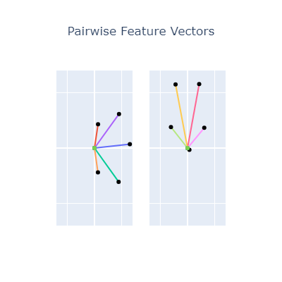
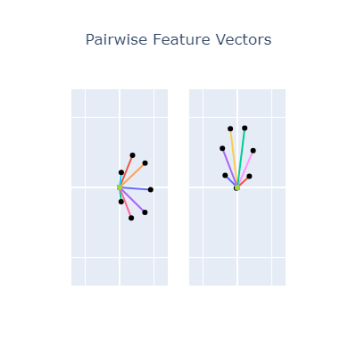

# Geometry

## Approach

There are probably better approaches to take but I settled for a semi-handcrafted approach.
I define structures I deem interesting for both 1 and 2 dimensional hidden layers.

- The single dimensional projections, I project evenly spaced point between -1 and 1 on this axis.
- In the two dimensional case, I sample evenly from the unit circle.

## Observations (p_w, p_v)

The setup for this is exactly as described in [here](./biases.md).

- 1 hidden - 2 features
  - This is a simple digon, the model learns the matrix [[1, -1], [-1, 1]]
- 1 dimensions - features
  - As expected, the model cannot learn more than 2 points into a single feature.
  - Deeper models can do so, but in this case, bilinear is equal to ReLU.
- 2 dimensions - 3 features
  - The model can decode 3 features. For output 0, it computes f_0 - 0.5 f_1 - 0.5 f_2
  - In very sparse cases it seems to prefer using a more digon-like structure which I can't yet explain.
- 2 dimensions - 4 features
  - It does the obvious thing, those are just two digons.
- 2 dimensions - 5 features
  - It does the obvious thing again, if you imagine a pentagon with the 0 at the top. It learns f_0 + 0.5 f_1 + 0.5 f_2 - 1.3 f_3 - 1.3 f_4
- 2 dimensions - n features
  - The pattern holds, nothing interesting here.

## Observation (w and v)

The setup for this analysis is very similar to Michael's setup for analyzing MNIST.
Also, we limit ourselves to 2D in this description.

- Create the symmetric feature pair vectors, this is a tensor of [instance, in1, in2, out] where in1 and in2 are the interactions.
- Since in1 and in2 are 2D, these can be plotted as directional vectors. 
- We take the sparsest model, rearrange the tensor into [in1, out, in2], meaning we have 2 slices of a [n, 2] matrix. 
- We draw an arrow for each n. This represents the transposed output-input interactions per dimension (this is vague...).

  

The plots above represent the 5 and 7 dimensional case, we can see that this represents the directions (orthogonally) without any bias.

> I should think more about exactly what this means.

## Why pentagons?

These experiments show that models can learn every kind of 2D structure. However, when also training the projection, the models always settles on only representing 5 features in 2 dimensions.

4: 
