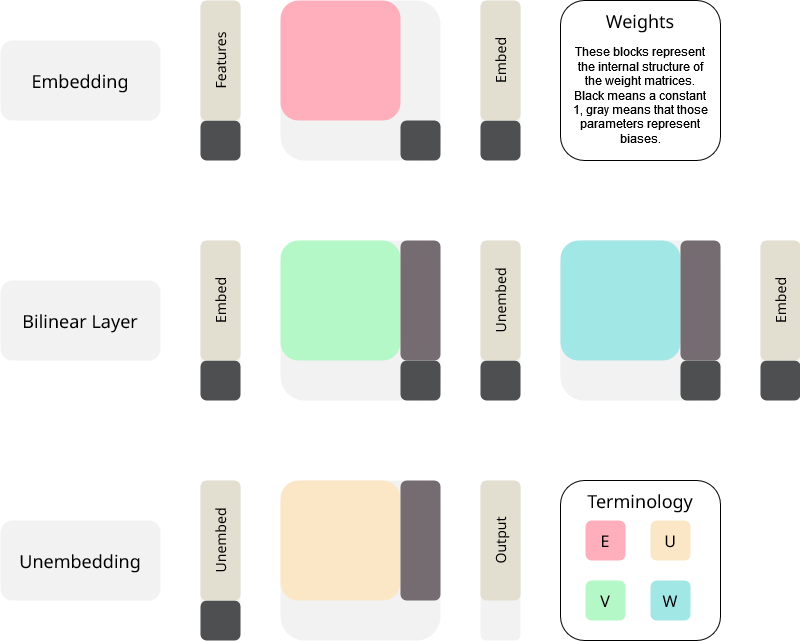
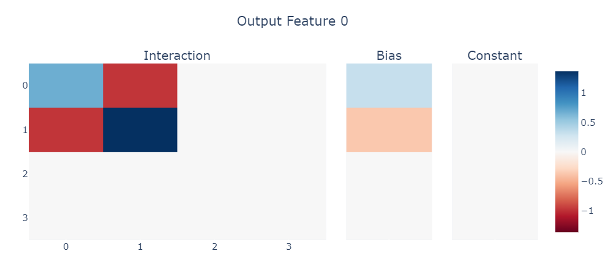
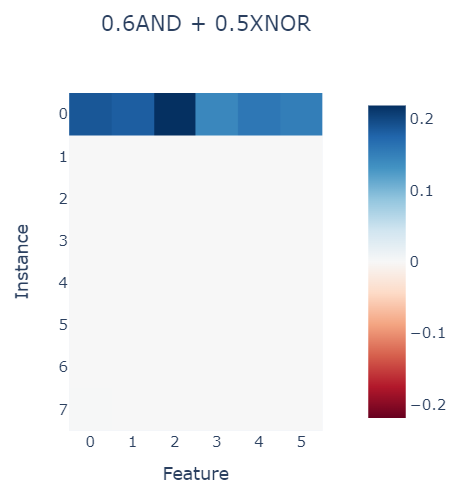
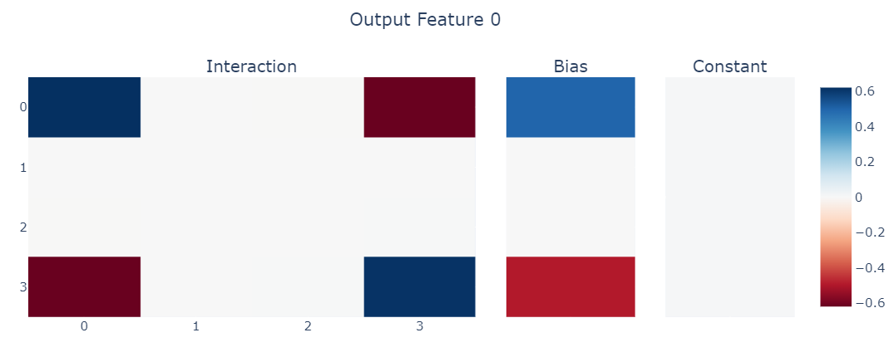
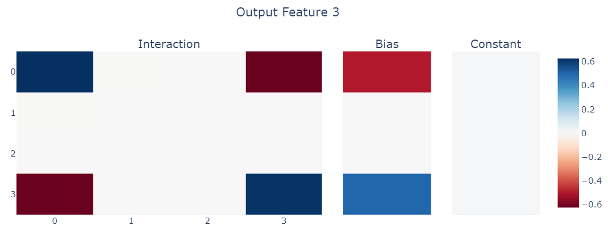
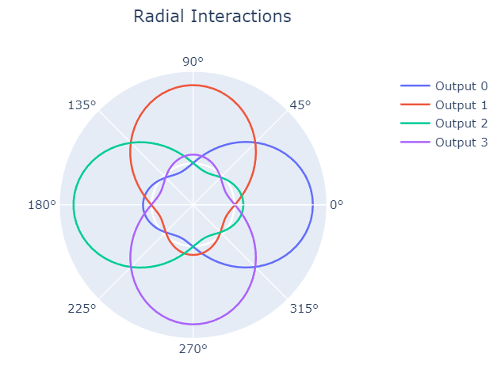
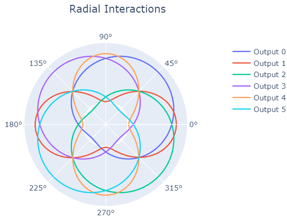

# Bilinear Toy Models

## Introduction

Gated Linear Units (GLUs) have recently become quite popular in large language models [[1]](https://arxiv.org/abs/2307.09288). These units perform the following operation $\sigma(W x) \odot (V x)$ where $\odot$ is an element-wise multiplication and $\sigma$ is an activation function (such as ReLU). Intuitively, these units use a distinct linear transformation on the input that acts as a sort of gate, this allows them to model more complex feature interactions, leading to improved accuracy at the cost of extra parameters. While this modification makes intuitive sense, it is not yet understood why these units work so well. The simplest form of a GLU, where the activation function is the identity ($W x \odot V x$), is known as a bilinear layer [[2]](https://www.cs.toronto.edu/~amnih/papers/threenew.pdf). This simple variant is often overlooked in favour of better-performing alternatives such as SwiGLU [[3]](https://arxiv.org/abs/2002.05202). However, due to the lack of non-linearity, these layers possess a lot of desirable properties for interpretability. Primarily, it is possible to study bilinear layers solely from their weights.

In ReLU-based networks, while it is possible to discern structure and circuits from the weights, this can often only be done to a limited degree. Consequently, most interpretability techniques make heavy use of sampling and gradient-based methods. These techniques have been shown to be effective but are generally approximative. In essence, a single small change can push a ReLU to activate, which in turn can trigger others. This is generally seen as the catalyst for deep learning's success but makes it near-impossible to make strong guarantees on which outputs models will be able to produce.

In bilinear layers, in contrast, a single output can be described in terms of an "interaction matrix" of features. This matrix makes it possible to make guarantees about the output and reason about the learned "algorithms" to compute it. This document will study if we can interpret these interaction matrices on toy models. Specifically, we will look at compression (aka superposition) and computation.

> This work is part of a collaboration with Michael Pearce and Alice Rigg, who are both looking at interpreting bilinear layers in a different context.

## Summary

Initial results show great promise in both the capability of bilinear layers and their interpretability. We study a three-layer toy model consisting of an embedding, bilinear layer and unembedding. In practice, this may correspond to the path through an MLP in a transformer, which has been very difficult to study comprehensively until now. These are our results:

- Given a model that performs an unknown binary task, such as a combination of binary operations (aka logical gates), we can recover this task from the weights alone.
- Given a model that has to perform compression, we can extract which features occur in superposition in the middle bilinear layer.

While these results are exciting, note that this currently only works for toy tasks. Combining tasks or studying dense tasks generally results in less clarity. We are however confident that it is still possible to find meaningful structure in more complex setups. Aside from these results, we have also uncovered insights into the general workings of bilinear layers in a deep-learning context.

- Bilinear layers with biases can perform any binary computation in a single layer (yes, also XORs).
- Bilinear layers cannot exactly represent the same form of superposition as a ReLU.
- Bilinear layers strongly outperform ReLUs in dense compression scenarios.
- In sparse scenarios, bilinear layers use digons and pentagons (we don't yet know why exactly).

For brevity, only the main results will be covered.

## Setup

We study bilinear layers of the form $(W x + b) \odot (V x + c)$. Adding biases grants additional expressivity to the model, however they make it slightly harder to interpret. Luckily, we can use a trick to incorporate the bias into weights: if we append a constant $1$ to the inputs and add an extra column to the weight matrices $W' = [W, b]$, we can retain the simpler form of $W' x' \odot V' x'$.

We use a 3-layer setup: an embedding, a bilinear layer and an unembedding. We believe this a useful setup to study as this occurs throughout residual models. The following image illustrates the setup and notational convention.



## Computation

We first look at computation, this will serve as a good introduction to our setup and how bilinear layers work. Specifically, we will look at a similar setup to [[4]](https://arxiv.org/abs/2210.01892). The model receives 4 inputs and must compute the xor between every pair as a distinct output feature. For simplicity, we force the embed and unembed to be the identity and therefore study only the bilinear layer. For clarity, we denote our setup using a simple config file.

```python
Config(n_epochs=2_000, n_embed=4, n_features=4, n_unembed=6, n_outputs=6, embed=identity, unembed=identity, task=dict(xor=1))
```

Training this model yields the following interaction matrix for output feature 0. Note that this model receives binary inputs. Results are shown for sparsity 0.5 (50/50 chance for a feature to be on or off) however results hold for all sparsities not too close to 0 or 1.



### Feature Interaction

To fully understand this plot, we need to do a small mathematical derivation on how a bilinear layer works exactly. Given the original formula, we can expand it to the full summation.

$$(W x + b) \odot (V x + c) = \left(\sum_i W_i x_i + b_i \right) \odot \left(\sum_j W_j x_j + b_j \right)$$

For output feature 0, there are two important input features, namely the first and the second. Let's simplify the sums.

$$ \left(w_0 x_0 + w_1 x_1 + b_0 \right) \odot \left( v_0 x_0 + v_1 x_1+ c_0 \right)$$

We can work this out distributively.

$$(w_0 v_0) x_0^2 + (w_1 v_1) x_1^2 + (w_1 v_0 + w_0 v_1) x_0 x_1 + (b_0 v_0 + c_0 w_0) x_0 + (b_0 v_1 + c_0 w_1) x_1 + b_0 c_0$$

Let's define some shorthand notation. Let's call weight-weight terms $f_{ij}$, the weight-bias terms $b_i$ and the bias-bias term $\gamma$. Let's also call the features $x_0 = x$ and $x_1 = y$

$$ f_{00} x^2 + f_{11} y^2 + (f_{01} + f_{10}) xy + b_0 x + b_1 y + \gamma$$

This is exactly what is shown on the plot:

- The interaction matrix shows the $f$ values (the weight-weight terms)
- The bias vector are the $b$ terms (the bias-weight term)
- The constant value is the $\gamma$ term (the bias-bias)

### Weights

For preciseness, the weights for output 0 of the xor are:

$f_{00} = 0.68, f_{01} = -0.99, b_0 = 0.32$

$f_{10} = -1.00, f_{11} = 1.32, b_1 = -0.32$

All other weights and biases are 0 (or 0.01). Given this information let's try to check if this is actually performing a xor operation. If both inputs are 0, all terms except $\gamma$ will resolve to 0 and as $\gamma = 0$, we have 0. If both are active, we can simply sum all terms and see that this is also 0. The other cases where only one feature is active results in 1, exactly the xor gate. This can be generalized in a visually pleasing way using truth tables.

### AND gate

|$x^2$|$y^2$|$xy$|$x$|$y$|$1$|out|
|:---:|:---:|:---:|:-:|:-:|:------:|:-:|
|0|0|0|0|0|$\gamma$|0|
|$f_{00}$|0|0|$b_0$|0|$\gamma$|0|
|0|$f_{11}$|0|0|$b_1$|$\gamma$|0|
|$f_{00}$|$f_{11}$|$f_{01} + f_{10}$|$b_0$|$b_1$|$\gamma$|1|

$\gamma = 0$

$f_{00} + b_0 = 0$

$f_{11} + b_1 = 0$

$f_{01} + f_{10} = 1$

### XNOR gate

The XNOR gate is 1 if both inputs are 0, however, this can still be represented using $\gamma$.

|$x^2$|$y^2$|$xy$|$x$|$y$|$1$|out|
|:---:|:---:|:---:|:-:|:-:|:------:|:-:|
|0|0|0|0|0|$\gamma$|1|
|$f_{00}$|0|0|$b_0$|0|$\gamma$|0|
|0|$f_{11}$|0|0|$b_1$|$\gamma$|0|
|$f_{00}$|$f_{11}$|$f_{01} + f_{10}$|$b_0$|$b_1$|$\gamma$|1|

$\gamma = 1$

$f_{00} + b_0 = -1$

$f_{11} + b_1 = -1$

$f_{01} + f_{10} = 1$

### XOR gate

Using the same technique, we can write the constraints for the XOR operation from above.

$\gamma = 0$

$f_{00} + b_0 = 1$

$f_{11} + b_1 = 1$

$f_{01} + f_{10} = -2$

We see that this holds.

### General Boolean Computation

In general, given a boolean truth table with entries $t_{00}$, $t_{10}$, $t_{01}$ and $t_{11}$, we can find a closed formula for the optimal weights. We achieve this by simply generalizing the above to this general case, we get:

$\gamma = t_{00}$

$f_{00} + b_0 = t_{10} - t_{00}$

$f_{11} + b_1 = t_{01} - t_{00}$

$f_{01} + f_{10} = t_{11} - t_{10} - t_{01} + t_{00}$

To get a more complex truth table than the ones above, we can combine gates in arbitrary ways. Let's try $t_{xy} = 3 \cdot \text{AND}(x, y) + 2 \cdot \text{OR}(x, y)$.

$\gamma = 0$

$f_{00} + b_0 = (2 + 0) - 0 = 2$

$f_{11} + b_1 = (2 + 0) - 0 = 2$

$f_{01} + f_{10} = (2 + 3) - 2 - 2 + 0 = 1$

We can use these formulae to compute which task the model has learnt. The image below measures the loss of the predicted truth table for each feature (separately) for varying sparsities (the instance rows). This only fails when sparsity is 0 (top row) and these models simply output a constant value.



### Multilayer computation

The above isn't groundbreaking, while a normal linear layer can't compute all binary operations, it's weights can also be used to determine how the computation is done. However, as this interaction matrix represents the complete bilinear layer, we aren't ignoring the non-linearity. This means we can multiply other matrices and vectors with this matrix to describe multiple layers at once. In essence, we can fold multiple layer into one and perform the same interpretability techniques. This is very powerful as we can now exactly determine computation across several layers.

First refresh some notation, the image near the top has this in diagrammatic form:

- Inputs (aka the features) are denoted as ``in``.
- Embeddings (after the embedding projection) are denoted as ``emb``.
- Unembeddings (after the bilinear map) are denoted as ``unemb``.
- Outputs (after the unembedding) are denoted as ``out``.

Until now, we've been inspecting the bilinear map in a per-feature manner as interaction matrices. These can be combined into a single object: a rank-3 tensor that stacks all these matrices together. We call this tensor B (for bilinear) and has dimensions $out \times in \times in$. This tensor is generally easier to compute with instead of writing for loops, but the ideas remain the same. What follows is some tensor manipulation, it doesn't matter if the exact operations aren't clear, the idea is simply that we are combining (aka folding) embeddings and unembeddings into the main tensor.

We can describe a bilinear map followed by an unembedding as the following einsum.

```python
UB = einsum(B, U, "unemb emb1 emb2, out unemb -> out emb1 emb2")
```

In the same way, the embedding matrix can be folded too.

```python
BE = einsum(B, E, E, "unemb emb1 emb2, emb1 in1, emb2 in2 -> out in1 in2")
```

Lastly, these multiplications can be chained by substituting $B$ by $BE$ or $UB$ in the first and second formula respectively. We call the resulting tensor $UBE$.

Importantly, as each of these described tensors is rank-3, **every** analysis technique we describe can be performed on any of them. In the next sections, we will use these techniques to extract superposition from arbitrary multi-layer models.

> While not covered here, it's also possible to incorporate residual connections into this tensor.

## Compression

Now, we will talk about superposition, or more generally: compression. We again start from a simple setup and increase the complexity from there. We are interested in the following setup, a linear projection and a bilinear layer (akin [superposition]()). This task uses random feature values (between 0 and 1) and the results shown are for ~90% sparsity.

```python
ToyConfig(n_epochs=3000, n_features=4, n_embed=2, n_unembed=4, n_outputs=4)
```

This yields the following interaction matrix (extracted from UBE), showing that features 0 and 3 are stored in a digon superposition and features 1 and 2 too (not shown).




The weights are $f_{00} = f_{11} = -f_{01} = -f_{10} = 0.62$ and the biases are $b_0 = -b_1 = 0.5$. To understand exactly why the weights take on these values, we should study the task a bit more formally. For this analysis, we will assume the embedding is antipodal. This means that the hidden dimension will be $\alpha = x - y$. If we wish to reconstruct $x$ from $\alpha$ in a sparse regime, we have to perform.

$$f_{00}\alpha^2 + b_{0}\alpha + \gamma \approx \max(\alpha, 0)$$

Due to sparsity, there is a strong incentive to have $\gamma = 0$, otherwise, the model is incorrect at almost each guess. Numerically solving this yields $f_{00}=0.619$ and $b_0=0.5$. Intuitively, setting $b_0$ to exactly half results in the least approximation as this results in the quadratic term being as small as possible. This is the derivation for $\alpha$ but we can replace that by $x-y$.

$$f_{00} (x-y)^2 + b_0 (x-y) = f_{00} x^2 + f_{00} y^2 - 2 f_{00} xy + b_0x + b_0y$$

To achieve this, $f_{11}$ must equal $f_{00}$ and the sum $f_{01} + f_{10}$ must be $-2f_{00}$.

> The reason for ReLU's success in large models may be due to the above formula, it is able to exactly represent digonal superposition.

An interesting way to visualize this approximation is through means of a radial plot.



The distance from the centre indicates the value of an output feature, and the angle represents the sampled input feature. We can see that each output feature is maximal along the embedding directions, 0 when orthogonal and makes a close approximation when negative. A ReLU has a similar structure but is exactly 0 between 90 and 270 for the blue line.

## Computation in Superposition

### Superposed Plus

In this section, we focus on performing addition in superposition. Specifically, we study the following config.

```python
Config(n_epochs=3000, n_embed=2, n_features=4, n_unembed=6, n_outputs=6, task=dict(add=1))
```

When studying binary (meaning two inputs) computation in superposition, there are two cases to distinguish: computation on orthogonally encoded features and computation on two interfering features. Trivially, when the two features to be used for computation interfere, it's impossible to reconstruct the exact answer. Furthermore, as the features get sparser, the "best" solution actually changes. We'll only cover the dense (0% sparse) and sparse (90+% sparsity) regimes.

#### Dense-Orthogonal

The model can't perform superposition so it will simply perform $x + y \approx 0.5\alpha + 0.5\beta + 1$ where $\beta$ is an orthogonal hidden dimension.

#### Sparse-Orthogonal

In the case of summing sparse orthogonal features, the model learns to simply sum the exact same values for normal superposition.
$$x + y \approx 0.62\alpha^2 + 0.62\beta^2 + 0.5\alpha + 0.5\beta$$

Intuitively, as the input becomes more sparse, the model can assume the signal to be more "pure" in either feature and perform aggressive approximations to the sum.

#### Dense-Interfering

The model simply learns the constant 1, this makes sense, as it is the expected value. It can leverage the prior distribution to not use any dimensions to represent this.

#### Sparse-Interfering

Again, as the model can assume sparsity, it makes the approximation of $\max(\alpha, 0) - \min(\alpha, 0) = |\alpha|$, the best approximation for this is $1.24 \alpha^2$.



## Caveat

The plots shown in this document are generally very pretty, this is not always the case. Specifically, the model may use arbitrary invariants in a task (for instance $f_{ii}x^2 = b_ix$ if $x \in \{0, 1\}$) that produce the same output but result in noisier interaction matrices. To counteract this, we generated the plots using weight decay and long enough training times.

## Conclusion

- Bilinear layers can compute a large range of operations in an sensible manner.
- Interaction matrices generated by toy models are generally easy to understand.
- While not shown to its full potential, tensor folding is extremely powerful for understanding multi-layer networks.

## Future Work

This project in itself has not been immensely useful in opening the black box of machine learning. However, I think it provides a very promising avenue towards understanding more complex behaviours in larger models. Currently, we are exploring this in the context of MNIST and TinyStories. Besides that, it could be cool to study more complex toy models such as finite state machines or some graph algorithms to see what we can extract from them.
