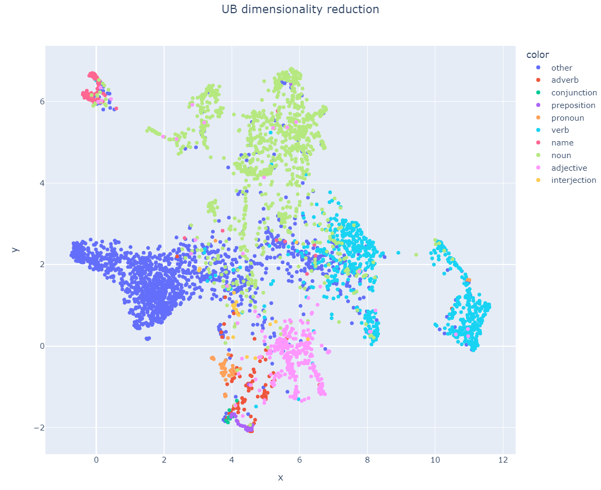
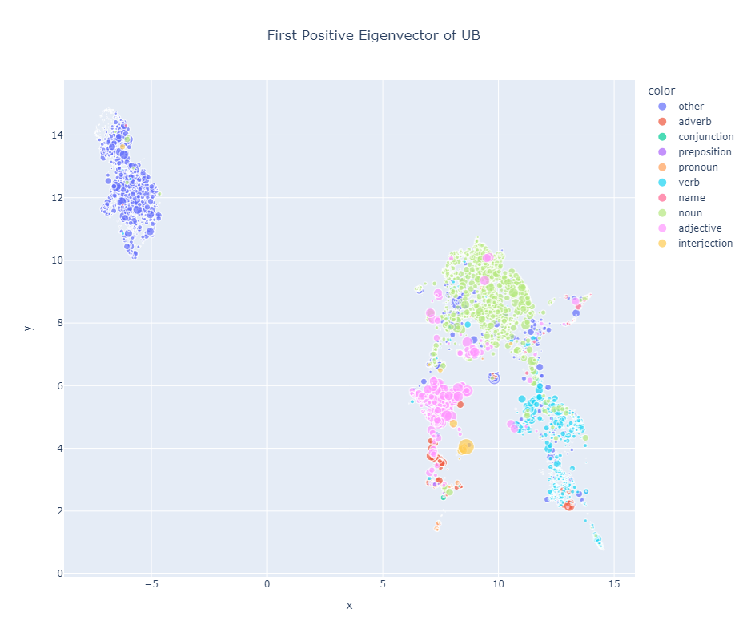
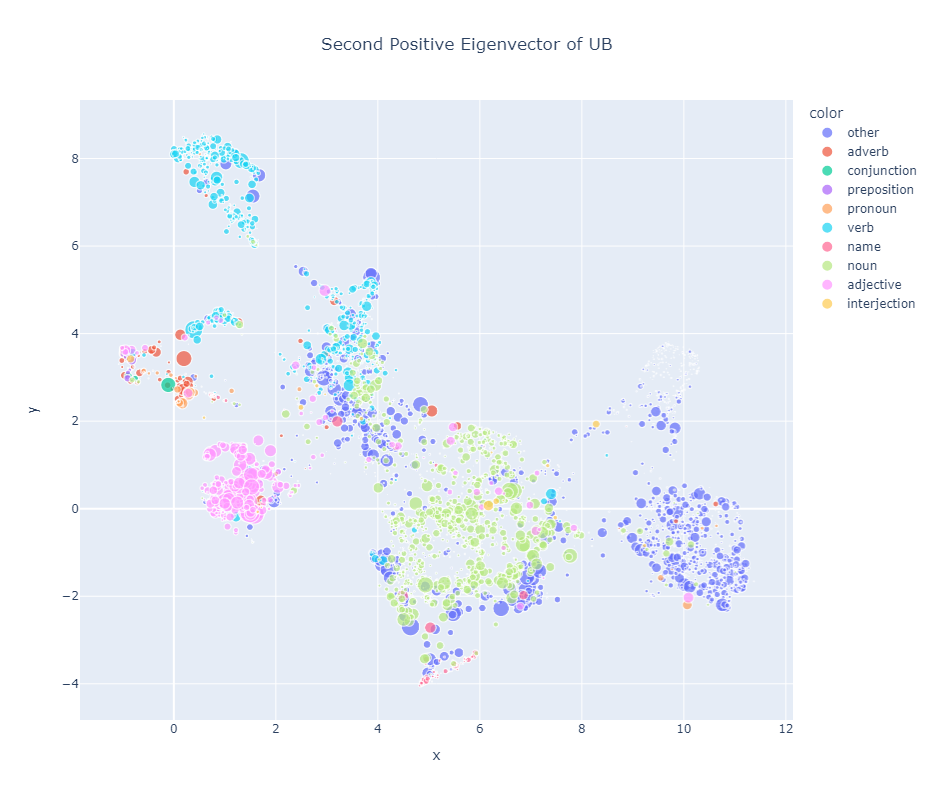

# Clustering

In this document, we will be analyzing weights of the network through means of dimensionality reduction and clustering. The main goal of this document is to get a means to understand what certain weight tensors are doing on a high level.

---

## Dimensionality Reduction

The B tensor, constructed from an MLP layer, is a large 3-tensor. It's most basic form, solely describing the hidden space, already has $2^24$ entries (when using 256 hidden dims). Understanding the hidden representations of the model is quite difficult, therefore at least one dimension needs to be projected to some output/input space. Unfortunately, when doing so, some information about the true internal structure is lost.

### General Setup

Clustering is very high dimensions generally produces unexpected results. Often, dimensionality reduction is used as a preprocessing step to get smoother results. Besides this, dimensionality reduction can also be used as a visualization tool. Note however that this isn't magic, all data points are arranged on a low dimensional space according to their distances. This cannot be done exactly and therefore there usually is a lot of information loss. For this exploratory high-level use-case, this is fine, but no strong mechanistic conclusions should be drawn from this analysis.

Generally T-SNE is the go-to dimensionality reducer. While it generally creates visually pleasing plots and mostly keeps inter-cluster data, it doesn't represent long distance relations (inter-cluster) very faithfully. In this case, this property is quite useful, it would allow to make some statements about the similarity of word types in relation to each other. Recently, UMAP was introduced to solve exactly this problem and other shortcomings of T-SNE. Therefore, we will exclusively use it for these experiments.

Dimensionality reductions can be done for 2D or 3D. For expressiveness, 3D is preferred but requires an interactive interface. Therefore, in this document we will stick to 2D.

### Metadata

While heatmaps allow us to visualize whole matrices and other complex interactions, scatterplots are arguably more powerful. Concretely, they allow the use of position, color, size and even marker shape. This results in teh possibility to represent many dimensions into a legible plot. This is a list of useful metadata that can be incorporated to augment the visualization.

- **Token Types.** If the plotted dots are in token-space, it's possible to label them according to their lexical categories (word classes). This will mostly be plotted as color.
- **Weight Norms.** The dimensionality reduction only provides distance information, not really magnitude. The magnitude may be handy to get an idea of "token importance" within a context. This is plotted as size.
- (virtual tokens as shape?)

Getting the a classification of token types is slightly difficult. The main challenge is to classify partial tokens (both starts and continuation tokens). In this analysis, this is handled using the following steps.

- Compute a ground truth word frequency table for the whole dataset (all punctuation except ' is removed and then split by spaces).
- Filter out words happening less than 50 times (the dataset is very noisy).
- If a token is not in this table, it is classified as ``Other``, meaning it's an incomplete token.
- All other remaining tokens are sent to GPT 3.5-turbo 16k to classify into 9 lexical categories (NLTK didn't work very well)

There are still some flaws but they seem annoying to fix. For instance, some nouns are also verbs or other overlaps are also possible. For instance ``coins`` is classified as verb to GPT but in children stories it's used only as noun. Furthermore, our above approach also isn't perfect: ``sophie`` is split into ``soph`` and ``##ie``. The model still treats ``soph`` as a name but it shows up as ``Other``. We will just accept and ignore these outliers but this is the reason for the noise.

### UB Tensor

This section studies dimensionality reduction on the UB tensor. In short, this does a dimensionality reduction on the inputs of the B tensor ($n_{hidden} \times n_{hidden}$) for each token $n_{vocab}$. That generates the following image.



We can see that the network strongly separates the tokens into several clusters, which seem to correspond very well to the ground truth labels. Inter cluster relations are very strong: all animals are closely together in the noun category, same goes for foods, objects and people. The people cluster is also closest to the name cluster, which is sensible.


### Augmenting Visualizations

The above is interesting and shows a lot of structure in the matrix but doesn't really reveal what the model is doing.


<!-- ### UB Eigenvectors

Until now, we've only really studied very low-level explanations of eigenvectors in the weights. Using this technique, we can do so a bit more comprehensively and actually understand what's going on (at least on a high level). Concretely, we compute the eigendecomposition of UB (batched over output tokens) and then reduce the outer product of the linear kernels (the kernels themselves were not that clear).

> The size of the dots represents the (squared) entries on the input diagonal. So this represents which (direct) inputs are important for the eigencomponents.



We can see that this first positive eigencomponent has one job. It separates the complete form incomplete tokens. Beyond this nice distinction, there are some other nontrivial clusters in this plot (which cannot be depicted here): a numbers cluster, a bird attribute cluster (feather, beak, ...) and so forth. This components doesn't seem to care too much for different verbs.



The second one is slightly more nuanced, it separates the starting ``Other`` tokens (left/middle) and the continuing ``Other`` tokens (right), it also seems to match them with slightly related stuff. It separated verbs into three categories:

- active: doing, growing, going (left)
- past: shouted, hung, helped (top)
- current: build, make, need (right)

It's actually fun how much structure there is. For conciseness we will stop here but you get the idea, the first eigencomponents strongly correspond to very interpretable features. Unfortunately, the middle eigencomponents don't; it's difficult to discern very clear clusters in them. They still make sense but it's obvious they represent more noisy patterns. The most negative eigencomponents also make sense though (also not shown). -->

## Stuff that didn't work

- Taking the B tensor and reducing dimensions in the hidden (output) space doesn't work too well, almost all points are equally distanced. If we take the direct input diagonal norm again, 3 hidden dimensions pop out though: 139, 77 and 54.

## Next steps

- Incorporate attention into this visualization

## Appendix

### Token Classification Prompt

```
I will give you a long list of words which I want you to classify into some categories. When choosing, pick the most specific one, for instance, Name over Noun. The categories are:

1) Name
2) Noun
3) Verb
4) Adjective
5) Adverb 
6) Pronoun
7) Preposition 
8) Conjunction 
9) Interjections

I want you to respond for each pair/line in the following way: 50 mary -> 50 Name
```

### Cosine Similarity of Outer Product

The eigen decomposition of the Q matrix will yield a set of linear kernels. Taking these kernels represent the best approximation of the Q matrix if they are outer multiplied together. As the outer product is taken between a kernel and itself, this is a very concise description of the input direction. We will now show some properties these kernels have in the calculation of distance metrics.

Let $K_i$ be a linear kernel (an eigenvector of Q), then the cosine similarity $\bra{K_i}\ket{K_j}^2 = \bra{K_i \otimes K_i}\ket{K_j \otimes K_j}$. The proof is quite trivial and probably well known.
