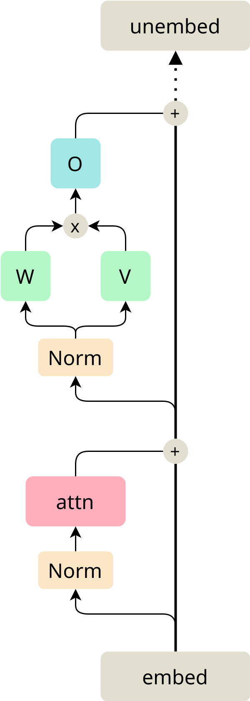

# Analyzing Bilinear Language Models

A while ago, this [paper](https://arxiv.org/abs/2002.05202) has shown that gated linear units and it's variants are a good fit for the transformer architecture. More recently, this [paper](https://arxiv.org/abs/2305.03452) argues that the simplest form of the gated linear unit, the bilinear layer, is an inherently interpretable object. In this document, we want to tackle the ambitious task inventing interpretability techniques to thoroughly understand this class of models. We aim to achieve this on the simplest (real-world) language task; children's stories. [TinyStories](https://arxiv.org/abs/2305.07759) is an awesome dataset due to its simplicity. In short, it contains 2 million stories using the vocabulary of a 3-year old. This makes it possible to use tiny models to fit this dataset. Fascinatingly, these tiny models (with even less than 1M parameters) can coherently construct simple sentences and relate certain words together to tell a story.

## Setup

Usually, language models are trained with a single goal in mind, achieve the lowest loss (or complexity) possible. In this work, this isn't the case, we strive to optimize for interpretability. This means that as long as the model can generate coherent output, we don't really care about how good the generated text is. This allows us to make some strong design choices which significantly simplify the model. The following sections describe the setup and design process in no particular order.

> This part may not be that useful if you're only interested in results or techniques. In that case, you can simply skip ahead.

### Architecture

HuggingFace contains a wide range of transformer models that can be tweaked without much effort. However, all these models obviously use ordinary activation functions such as GeLU (and lots of other weird names ending in LU). Hence, we need to create our own models. Luckily, there are great resources online, such as this [repository](https://github.com/karpathy/nanoGPT) from Andrej Karpathy.

Below is an image of the architecture and notation we settled on. In terms of noteworthy design choices there isn't much to say. This uses RMSnorm, instead of LayerNorm as most modern architectures do. We use multi-head attention (generally with head size ~64), which also isn't a shocker. We also use no weight tying.

### Ablations

We also performed a limited amount of semi-rigorous ablations:

**Switching the order of the MLP**. Swapping the linear projection and the bilinear operations is way worse (loss goes up by 0.2).

**Not using biases in the bilinear layer**. The difference is negligible but slightly in favor of including it, this again changes in large models.

**Not using biases in the normalization**. The difference is surprisingly negligible in small models (loss goes up by 0.02). More complex models seem to struggle though by not including them.

**Initialization**. I haven't studied this in-depth, it seems to have a large impact (easily 0.1 loss). The initialization variation between runs seems to not matter at all (same loss up to 2 decimal points).

**Comparison to ReLU**. From a handful of experiments we can corroborate the findings of this [paper](https://arxiv.org/abs/2002.05202). For fairness, we use the usual $n_{hidden} = 4 \cdot d_{model}$ for ReLU and $n_{hidden} = 3 \cdot d_{model}$ for the bilinear case. This results in about $8\%$ more parameters for the bilinear setup (using a multiplier of 2 still outperforms the ReLU, which is $16\%$ less parameters) and outperforms it by a loss of ~0.05.

### Training

We perform training with a default HuggingFace trainer, no special settings at all. $\text{lr}=0.001$ and $n_{batch} = 16$. Most models take about 20-30 minutes to train on my NVIDIA RTX 4080. I haven't calculated the effective FLOPS but given the its temperature and lack of noise, there is probably some bottleneck.

### Tokenizer

The original TinyStories models use the pre-trained NeoGPT tokenizers. However, to keep the parameter count down, they only use the top 10,000 tokens. While, this results in a semi-general tokenizer, here, we don't care about that. Reducing the vocabulary size is generally nice for interpretability because this generally results in less tokenization aberrations that have been plaguing the mechinterp community for a while. Furthermore, small vocabularies actually make it possible to fully plot interaction matrices.

Therefore, we decided to train our own tokenizers, specifically for TinyStories. In the spirit of interpretability, we made some interesting design decisions: only ascii characters and only lowercase letters. We separate punctuation into distinct tokens and use the WordPiece algorithm. I'm no expert on BPE vs WordPiece but the latter seems to better fit this use-case intuitively.

Using this setup, we can drastically compress the vocabulary into 3 sizes: 4096, 2048, and 1024. The large tokenizer has a separate token for almost all common words (even animals and simple names) that occur in children's stories, it uses 188 tokens on average per story. The medium tokenizer also has separate tokens for almost each word but starts to separate noticeable more words, its mean is 203 per story. The smaller one obviously splits all but the most common words, it uses 229 tokens on average.

Having a more focussed tokenizer also strongly eases the training process, resulting in lower loss and cleaner generation. It also strongly reduces the amount of embedding/unembedding parameters.

> As a tiny aside, we found that a significant part of the training data has some corruption. We removed this, it doesn't really make a difference.

### Accuracy

Our optimizations of the tokenizer and the bilinear layer result on some very strong models. We are generally able to beat their loss with models that are half or even a third of the size (on the 4096 tokenizer for the most fair comparison). Our 400K model, outperforms the 1.2M model, our 1.1M model outperforms their 3.5M model and so forth. While this doesn't really matter too much, its nice to see.

### Models

I pushed a wide range of models onto [my HuggingFace account](https://huggingface.co/tdooms). Generally, all models use the medium tokenizer and use the convention "TinyStories-{n_layer}-{d_model}". There are a few models, trained on the small tokenizer, called "MicroStories-...". The tokenizers are named after their vocabulary size.

## Techniques

In general, all analysis techniques for bilinear transformers kinda boil down to three steps.

- **Folding**: Fold together a bunch of matrices and tensors.
- **Subsetting**: Efficiently compute a subset of this tensor.
- **Analyzing**: Study this object (often a matrix) with existing techniques.

For instance, our main technique for studying MLP layers is as follows:

- Fold $E$, $L$, $R$, $P$, and $U$ into a single rank-3 tensor, this describes the exact computation of the full MLP.
- Compute the diagonal across the last two dimensions (the direct same token path).
- Study the result using SVD or simply average over rows/cols.

In theory, this is quite simple but in reality it requires some engineering. Specifically, we can never actually construct the folded tensor, sensibly speaking (this specific instance would be ~250GB in memory). Therefore, we have to directly construct our analysis subset in a smart manner. Luckily, we can almost always do so quite easily, it is a bit math-y but the ideas are simple.

### Folding

There are several interesting objects to study in a single layer bilinear transformer. First, let's introduce some notation:

- The $B_l$ tensor consists on the full MLP, it's a combination of the $L_l$, $R_l$ and $P_l$ matrices of layer $l$. In it's full form, it has dimensions [d_model, d_model, d_model].
- The $B^+_l$ tensor described the full MLP and the residual stream. Intuitively, it can be thought of as $B_l + I$.
- The $OV_{l.h}$ matrix, sensibly named after the combination of $O_l$ and $V_l$, is well known and serves as "the output part" of each attention head. We index it using the $layer.head$ notation.
- Similarly, the $QK_{l.h}$ matrix is constructed using $Q_l$ and $K_l$ and represents "the input part" of a head.

We often simple omit the layer subscript because the tensors can be computed for any layer/head.

First, there is the $U(E^TBE)$ tensor, which describes a full path through the MLP. This can be augmented to the $U(E^TB^+E)$ tensor, including the residual stream. The latter describes the full single layer model, ignoring attention.

> It's actually impossible to construct the $B^+$ tensor without using a handful of tricks. Counterintuitively, computing its compositions is often easier and requires a single summation.

Another interesting tensor describes the path of a token through the OV circuit, which is $U(E^T B OVE)$. Naturally, there are many more possibilities, these are just examples we found that are easy to understand.

### Subsetting

While subsetting can take many forms, the most common form takes the full rank-3 tensor and extracts a useful matrix from it.
For instance, we can simply flatten a full dimension by indexing a certain token. For instance, we can study $U_{game} (E^TBE)$, which results in an interaction matrix for the token ``game``. This can be done for any dimension of the tensor.

Another approach is to to some meaningful reduction over multiple axes. The main example is taking the diagonal of the input axes. This yields a form of map between direct inputs and outputs. In the MLP case $U(E^TBE)$, it is simply an extended form of the embedding/unembedding path, indicating which tokens the model predicts for certain inputs. This generally allows us to extract the bi-grams the model has learnt.

The diagonal subset is also quite useful for attention $U(E^T B OVE)$ as it provides a map of the meaning of the OV circuits through an MLP. Intuitively, it is a "dictionary" of which tokens get mapped to other tokens given they passed through a certain head. Empirically, we found this to very useful in studying trigrams in the first layer.

### Analysis

Given a certain subset (often a matrix), we still need to perform the actual interpretability part. This is inherently less rigorous than above techniques.Currently, we mostly use naive methods such as looking at maximal activations. While these maximal activations may be slightly illusory, we are looking at the weights directly, so it's less prone to spurious correlations. Building further upon maximal activations, we've found that looking at SVD components ($u_i s_i v^T_i$) generally separates semantic explanations quite well.

Beyond this, we can perform heuristic studies by averaging over rows/columns and studying their dimensionality. Any technique for analyzing a matrix is fine.

## Results

We won't go too in-depth into results here but they paint an promising picture. Here are some Jupyter notebooks outlining them.

- [MLP bigrams](../results/bigram.ipynb)
- [Attention Maps](../results/enrichment.ipynb)

## Future work

There is a lot still to do. We are currently most concerned with the limitations of our subsetting techniques. While a single matrix is very easy to work with (and is seemingly able to already reveal lots of structure), it discards too much information. The diagonal technique ignores any for of indirect interaction, which is supposedly the majority of all computation. The indexing also removed any possible generalizations across token, intuitively, if the model handles ``boy`` and ``girl`` in 99% the same way, we have no way to simplify this.

Therefore, we are working on a list of potential solutions leveraging potential sparsity in the model. There are a few facts to consider before doing so.

- Currently, we are working with d_model=256, so computing $B$ is very feasible (64 MB). This means we can compute any form of composition, as long as we ignore the embedding/unembedding.
- Attention heads are very low-rank compared to token space, d_head=64 so their rank is maximally the same. This means that, for each head, we can use $U QK E$ to determine a sparse subset (in eigenspace) of tokens per head.
- We believe we can leverage this combination to create a very sparse rank-3 tensor that described the path through an attention head and an MLP. Potentially using SAE or other sparse methods can give insights into the structure.
- This sparse structure can be piece-wise reconstructed into token-space quite easily.

Of course, this is a single idea, but it shows promising directions forward.
